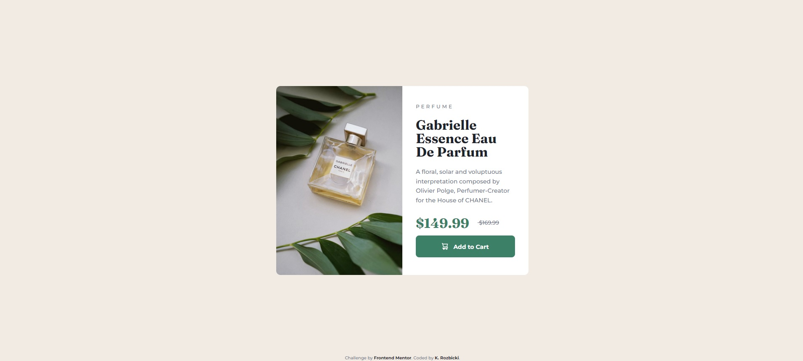

# Frontend Mentor - Product preview card component solution

https://krzysztofrozbicki.github.io/fem-challenge-1/

This is a solution to the
[Product preview card component challenge on Frontend Mentor](https://www.frontendmentor.io/challenges/product-preview-card-component-GO7UmttRfa).
Frontend Mentor challenges help you improve your coding skills by building realistic projects.

## Table of contents

- [The challenge](#the-challenge)
- [Screenshot](#screenshot)
- [Links](#links)
- [My process](#my-process)
  - [Built with](#built-with)
  - [What I learned](#what-i-learned)
  - [Continued development](#continued-development)
- [Author](#author)
- [Acknowledgments](#acknowledgments)

### The challenge

Users should be able to:

- View the optimal layout depending on their device's screen size
- See hover and focus states for interactive elements

### Screenshot



### Links

- Solution URL: https://github.com/KrzysztofRozbicki/fem-challenge-1
- Live Site URL: https://krzysztofrozbicki.github.io/fem-challenge-1/

## My process

### Built with

- Semantic HTML5 markup
- CSS custom properties
- Flexbox
- Mobile-first workflow

### What I learned

- How to calculate the responsive height of flex depending on picture height/width ratio.

```css
.product {
  height: calc(100vh - 3rem - ((100vw - 2rem) * 0.7));
}
```

- How to change the svg code into sprite, so you can use it with <use> method instead of putting
  full <svg> into the HTML.

- How to name the classes due to Tailwind.

- Checking responsive layouts by dev-tools on different platforms and devices.

### Continued development

Improve planning the design and speed of simplicity solutions.

## Author

- GitHub - [GitHub] (https://github.com/KrzysztofRozbicki)
- Website - [Pogbit](https://www.pogbit.com/)
- Frontend Mentor - [@KrzysztofRozbicki](https://www.frontendmentor.io/profile/KrzysztofRozbicki)

## Acknowledgments

- I tried to make it fully responsive, so I made the full product text + button a flexbox, that is
  responsive to height of mobile devices, without any big whitespaces nor with issue of not having
  enough space.
